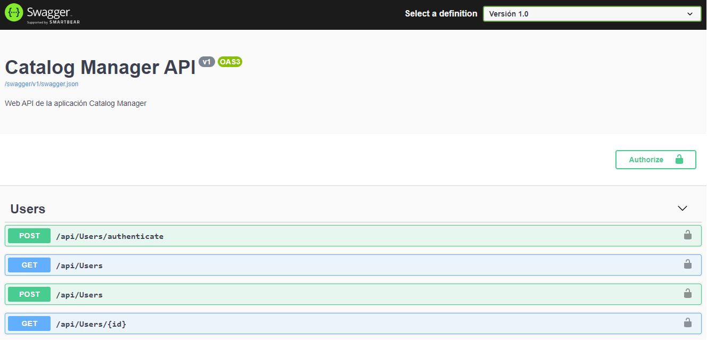

## API REST con ASP.NET Core

Descripción paso a paso para la construcción de una API REST con **ASP.NET Core**, tomando como base los instructivos presentados en la <a href="https://docs.microsoft.com/es-es/aspnet/core/tutorials/first-web-api?view=aspnetcore-3.1&tabs=visual-studio-code" target="_blank">documentación oficial</a>.


> __Requisitos previos__:

>* [Instalación plugin C# para VSCode](https://marketplace.visualstudio.com/items?itemName=ms-dotnettools.csharp)


>* [Instalación SDK de .NET Core](https://dotnet.microsoft.com/download/dotnet-core)


---

## Creación del proyecto

Desde la terminal se ejecutan los siguientes comandos:

```
dotnet new webapi -o CatalogManagerApi
cd CatalogManagerApi
```

&nbsp;

---

## Modelos

Se crearán los modelos partiendo de una base de datos **Sql Server** existente, utilizando herramientas provistas por **Entity Framework Core**. Se tomó como base un <a href="https://www.learnentityframeworkcore.com/walkthroughs/existing-database" target="_blank">instructivo de la página learnentityframeworkcore.com</a>

&nbsp;
Primero se agregarán los paquetes necesarios:


```
dotnet add package Microsoft.EntityFrameworkCore.SqlServer
dotnet add package Microsoft.EntityFrameworkCore.Design
```

&nbsp;
Luego se verificará que las utlidades para crear los modelos estén disponibles

```
dotnet ef -h
```

&nbsp;
En caso que ocurriera algún error del estilo "command not found" se deberá instalar:

```
dotnet tool install --global dotnet-ef
```

&nbsp;
Una vez todo verificado se procede a la **creación de los modelos importados desde la base de datos:**

```
dotnet ef dbcontext scaffold "Server=jcb-lenovo;Database=CatalogManager;Trusted_Connection=True;" Microsoft.EntityFrameworkCore.SqlServer -o Models -c "CatalogManagerContext"
```

---

## Registro del contexto de base de datos

En el paso anterior se crearon los modelos y el contexto de base de datos. Para registrar dicho contexto en la aplicación se deberá modificar el archivo **Startup.cs**

&nbsp;
Se incorporan las siguientes importaciones:

```cs
using Microsoft.EntityFrameworkCore;
using CatalogManagerApi.Models;
```

&nbsp;
Y se agrega el contexto en el método *ConfigureServices()*:

```cs
public void ConfigureServices(IServiceCollection services)
{
    services.AddDbContext<CatalogManagerContext>(opt =>
        opt.UseSqlServer("Server=jcb-lenovo;Database=CatalogManager;Trusted_Connection=True;"));
    services.AddControllers();
}
```

---

## Controladores

Se creará el controlador *UsersController*, en función del modelo *Users*, utilizando la herramienta `aspnet-codegenerator`.

&nbsp;
Primero se agregan los paquetes necesarios y se instala la herramienta:

```
dotnet add package Microsoft.VisualStudio.Web.CodeGeneration.Design
dotnet add package Microsoft.EntityFrameworkCore.Design
dotnet tool install --global dotnet-aspnet-codegenerator
```

&nbsp;
y luego se ejecuta el comando que creará el controlador aplicando el scaffolding:

```
dotnet aspnet-codegenerator controller -name UsersController -async -api -m Users -dc CatalogManagerContext -outDir Controllers
```

---

## Swagger / Open API

La documentación oficial presenta 2 herramientas para generar todo el código correspondiente a Swagger para la API. Ellas son [Swashbuckle y NSwag](https://docs.microsoft.com/es-es/aspnet/core/tutorials/web-api-help-pages-using-swagger?view=aspnetcore-3.1). A continuación será detallada la utilización de la primera de ellas.

&nbsp;
Primero se descarga el paquete necesario:

```
dotnet add package Swashbuckle.AspNetCore -v 5.0.0
```

&nbsp;
Luego en el archivo **Startup.cs**:

&nbsp;
Se importa el siguiente espacio de nombres para que use la clase *OpenApiInfo*:

```cs
using Microsoft.OpenApi.Models;
```

&nbsp;
Se agrega el generador de Swagger a la colección de servicios en el método en el método *ConfigureServices()*:

```cs
public void ConfigureServices(IServiceCollection services)
{
    . . .

    // Generador Swagger. Se pueden definir 1 o mas documentos
    services.AddSwaggerGen(c =>
    {
        c.SwaggerDoc("v1", new OpenApiInfo
        {
            Version = "v1",
            Title = "Catalog Manager API",
            Description = "Web API de la aplicación Catalog Manager"
            //TermsOfService = new Uri("https://example.com/terms"),
            //Contact = new OpenApiContact
            //{
            //    Name = "Juan C. Bryksa",
            //    Email = "jcbryksa@gmail.com",
            //    Url = new Uri("https://github.com/jcbryksa"),
            //},
            //License = new OpenApiLicense
            //{
            //    Name = "Use under LICX",
            //    Url = new Uri("https://example.com/license"),
            //}
        });
        //


        // Establece el boton de Autorizacion  para persistir el token JWT
        c.AddSecurityDefinition("Bearer", new OpenApiSecurityScheme
        {
            Description = "JWT Authorization header using the Bearer scheme. \r\n\r\n Enter 'Bearer' [space] and then your token in the text input below.\r\n\r\nExample: \"Bearer 12345abcdef\"",
            Name = "Autorizacion",
            In = ParameterLocation.Header,
            Type = SecuritySchemeType.ApiKey,
            Scheme = "bearer"
        });

        c.AddSecurityRequirement(new OpenApiSecurityRequirement{
            {
                new OpenApiSecurityScheme{
                    Reference = new OpenApiReference{
                        Id = "Bearer", //The name of the previously defined security scheme.
                        Type = ReferenceType.SecurityScheme
                    }
                },new List<string>()
            }
    });
    //
    . . .

}
```

&nbsp;
Se habilita el middleware para servir el documento JSON generado y la interfaz de usuario de Swagger, en el método *Configure()*:

```cs
public void Configure(IApplicationBuilder app)
{
    // Enable middleware to serve generated Swagger as a JSON endpoint.
    app.UseSwagger();

    // Enable middleware to serve swagger-ui (HTML, JS, CSS, etc.),
    // specifying the Swagger JSON endpoint.
    app.UseSwaggerUI(c =>
    {
        c.SwaggerEndpoint("/swagger/v1/swagger.json", "Versión 1.0");
    });

    app.UseRouting();

    . . .

}
```

---

## Autenticación JWT

Se incorporará la autenticación por JSON Web Tokens (JWT), basado en <a href="https://jasonwatmore.com/post/2019/10/11/aspnet-core-3-jwt-authentication-tutorial-with-example-api#user-service-cs" target="_blank">un tutorial de ejemplo</a> que hace referencia a un <a href="https://github.com/cornflourblue/aspnet-core-3-jwt-authentication-api" target="_blank">repositorio Github</a>.

&nbsp;
Primero se descargan los paquetes necesarios:

```
dotnet add package Microsoft.AspNetCore.Authentication.JwtBearer
dotnet add package System.IdentityModel.Tokens.Jwt
```

&nbsp;
Se agrega la entrada `Secret` a **appsettings.json**:

```json
  "AppSettings": {
    "Secret": "SECRET USED TO SIGN AND VERIFY JWT TOKENS"
  },
```

&nbsp;
y la clase *AppSettings* en Helpers:

```cs
namespace CatalogManagerApi.Helpers
{
    public class AppSettings
    {
        public string Secret { get; set; }
    }
}
```

&nbsp;
En el archivo **Startup.cs**:

&nbsp;
Se importan los siguientes espacios de nombres:

```cs
using Microsoft.IdentityModel.Tokens;
using System.Text;
using Microsoft.AspNetCore.Authentication.JwtBearer;
```

&nbsp;
Se agregan las entradas correspondientes a la colección de servicios en el método *ConfigureServices()*:

```cs
public void ConfigureServices(IServiceCollection services)
{
    . . .

    // Establece un objeto de configuracion
    var appSettingsSection = Configuration.GetSection("AppSettings");
    services.Configure<AppSettings>(appSettingsSection);

    // Determina el metodo de autenticacion JWT
    var appSettings = appSettingsSection.Get<AppSettings>();
    var key = Encoding.ASCII.GetBytes(appSettings.Secret);
    services.AddAuthentication(x =>
    {
        x.DefaultAuthenticateScheme = JwtBearerDefaults.AuthenticationScheme;
        x.DefaultChallengeScheme = JwtBearerDefaults.AuthenticationScheme;
    })
    .AddJwtBearer(x =>
    {
        x.RequireHttpsMetadata = false;
        x.SaveToken = true;
        x.TokenValidationParameters = new TokenValidationParameters
        {
            ValidateIssuerSigningKey = true,
            IssuerSigningKey = new SymmetricSecurityKey(key),
            ValidateIssuer = false,
            ValidateAudience = false
        };
    });
    //

    // Disponibiliza UserService para inyecion de dependencia
    services.AddScoped<IUserService, UserService>();

    . . .
}
```

&nbsp;
Se agregan los middlewares correspondientes a la autenticación, en el método *Configure()*:

```cs
public void Configure(IApplicationBuilder app)
{
    . . .

    app.UseAuthentication();
    app.UseAuthorization();

    . . .

}
```

&nbsp;
Luego, en **UsersController** se agrega la anotación `Authorize`, se establece el método *Authenticate* y se anota con `AllowAnonymous` sobre cada método en donde no se requiera autenticación.

```cs
using System;
using System.Collections.Generic;
using System.Linq;
using System.Threading.Tasks;
using Microsoft.AspNetCore.Http;
using Microsoft.AspNetCore.Mvc;
using Microsoft.EntityFrameworkCore;
using CatalogManagerApi.Models;
using CatalogManagerApi.Services;

using Microsoft.Extensions.Configuration;
using Microsoft.AspNetCore.Authorization;


namespace CatalogManagerApi.Controllers
{
    [Authorize]
    [ApiController]
    [Route("api/[controller]")]
    public class UsersController : ControllerBase
    {
        private readonly CatalogManagerContext _context;

        private readonly IConfiguration _config;

        private IUserService _userService;

        public UsersController(CatalogManagerContext context, IConfiguration config, IUserService userService)
        {
            _context = context;
            _config = config;
            _userService = userService;
        }

        [AllowAnonymous]
        [HttpPost("authenticate")]
        public IActionResult Authenticate([FromBody]AuthenticateRequest model)
        {
            var response = _userService.Authenticate(model);

            if (response == null)
                return BadRequest(new { message = "Username or password is incorrect" });

            return Ok(response);
        }


        // GET: api/Users
        [HttpGet]
        public async Task<ActionResult<IEnumerable<Users>>> GetUsers()
        {
            return await _context.Users.ToListAsync();
        }

    . . .

}
```

&nbsp;

### Interfaz gráfica de Swagger

Una vez obtenido el token se lo debe ingresar mediante el botón **Authorize**

Note: **Importante.** Se debe anteponer el prefijo "Bearer" al token


