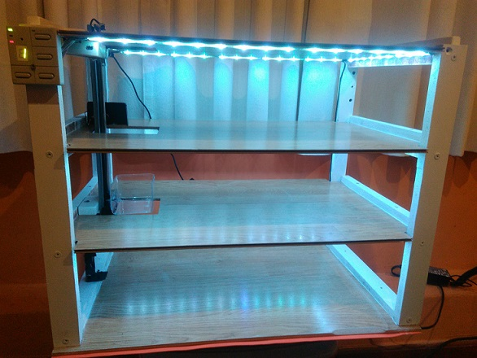
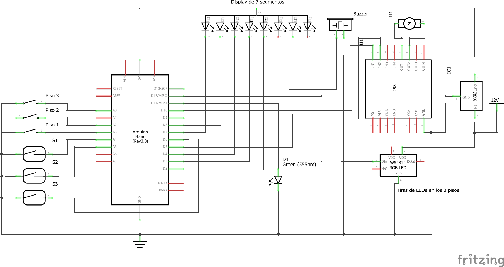

# Estación de Autos

La estación de autos es una maqueta de 63 cm de ancho x 40 cm de profundidad y una altura total de 50 centímetros.
Consta de 3 pisos + planta baja y un ascensor eléctrico para llevar los autitos de juguete.

La estación dispone de iluminación en cada uno de sus pisos utilizando tiras de LED RGB basadas en WS2811. Se aprovecha el uso de estas tiras para contar con distintos efectos de encedido/apagado.

La lógica está programada en C++ sobre una placa [Arduino](https://www.arduino.cc/) Nano utilizando [PlatormIO](https://platformio.org/) como entorno de desarrollo integrado con [Visual Studio Code](https://code.visualstudio.com/). Todo el código fuente se encuentra en <a href="https://github.com/jcbryksa/estacion-de-autos" target="_blank">este repositorio</a>.

---

---

&nbsp;

---

## Diagrama esquemático electrónico

&nbsp;

---

## Software de terceros

* [Arduino](https://www.arduino.cc/)
* [Adafruit_NeoPixel](https://github.com/adafruit/Adafruit_NeoPixel)
* [PlatormIO](https://platformio.org/)
* [Visual Studio Code](https://code.visualstudio.com/)
* [Fritzing](https://fritzing.org/)
